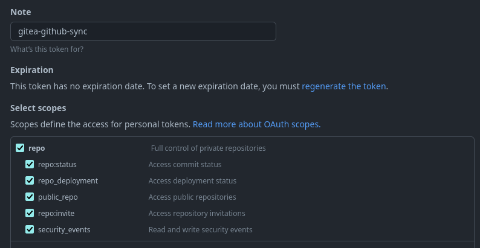

# gitea-github-sync

gitea-github-sync provides a simple CLI to sync Github repositories to your Gitea instance.

## Installation

```
pip install gitea-github-sync
```

## Setup
Create a file in `$HOME/.config/gitea-github-sync/config.yml` with the following template and fill up the missing values:

```yaml
gitea_api_url: https://<your-gitea-instance>/api/v1
gitea_token: <your-gitea-token>
github_token: <your-github-token>
```

### Creating a Gitea token
Go to https://\<your-local-gitea-instance\>/user/settings/applications and generate a new token.

### Creating a Github token

Go to https://github.com/settings/tokens/new and create a token with the following values set:
- Note: this is a note to help you understand how the token is used.
- Expiration: No expiration
- repo: Select all of repo



#### Github token limitation
Github allows you to create _Personal access tokens_. These tokens now exist in two different flavors:
- Fine-grained tokens
- Classic tokens

Both work with gitea-github-sync, but given that Gitea does not allow the modification of the access token through the API, a **non-expiring** token must be used which limits the usage to Classic tokens.

## Usage

`gitea-github-sync --help` Shows the help

`gitea-github-sync list-all-gitea-repositories` Lists all available Gitea repositories in your account

`gitea-github-sync list-all-github-repositories` Lists all available Github repositories in your account

`gitea-github-sync migrate-repo FULL_REPO_NAME` Migrates one repo from Github to Gitea
`
`gitea-github-sync sync` Migrates all repos not present in Gitea from Github

## Limitations

When using the migration feature of Gitea, a Github token must be passed for Gitea to continuously pull the new changes from Github.

The token used by gitea-github-sync to list repositories is the same that is used by Gitea for continuous monitoring. Updating the value of this token is unfortunately not possible through the API as of now. 
